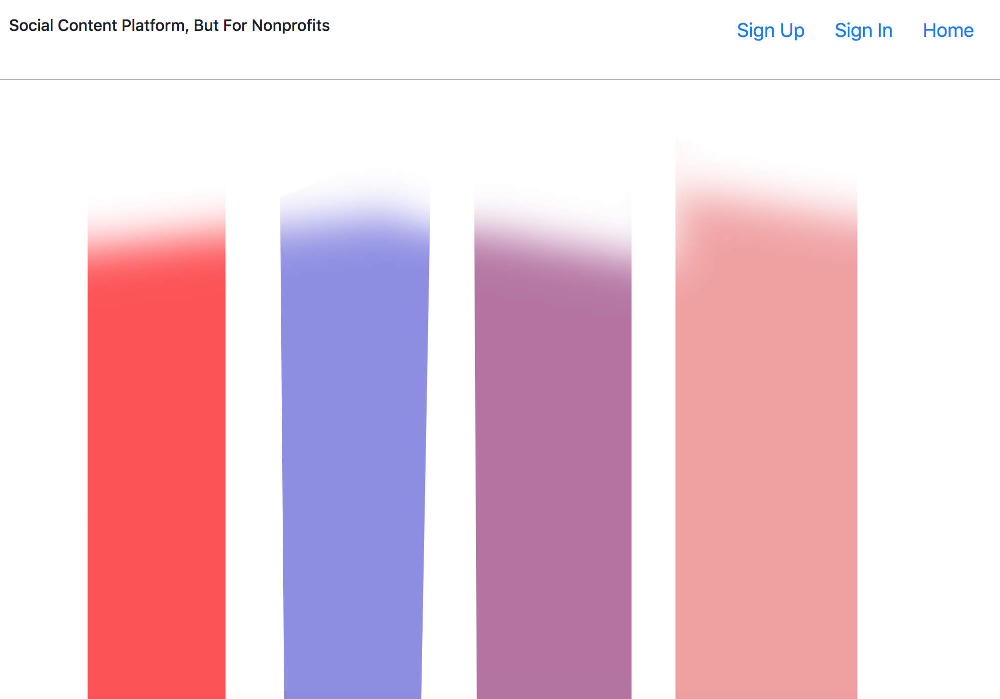

#### screenshot


### What it is

Hapsoon is a social media content platform for nonprofits to use in order to engage new audiences and decrease their reliance on annoying direct mail campaigns.

### What it does

Nonprofits, as read-write users, can sign up and sign in to the app. They then create episodes which are scrollable image displays that update their audience with news, appeals, or other forms of engagement.

### Technologies it uses

The front end is built with React.js and react-bootstrap
The back end is built with Express and Mongoose

### See the deployed sites:

[back end](https://enigmatic-hollows-62648.herokuapp.com/)

[front end](https://fritzable.github.io/capstone-client/)

### Repo for the front end:

[front end repo](https://github.com/fritzable/capstone-client)

### Plans for future fixes:

- Integrate cloud image hosting to support persistent storage of user-uploaded images
- Set up read-only user views with ability to search for and view all episodes
- search and filter episodes by owner
- improve UI navigation between episodes
- constrain images

### Planning and process:

- Chose to use a NoSQL database for flexibility in scaling up new additions to the schema and updating collections.
- Designed the data structure to hold images within episodes.
- Spent time establishing basic request routes to the api using curl scripts and becoming familiar with the syntax required by the nested data structure of the api.
- Built React components necessary to perform the basic CRUD http requests from the front end.
- timeboxed for a later version the functionality of uploading more than one image at once.
- Adapted a methodical approach of moving ahead only once a feature is working to the distributed style of React developing, as it could be easy to lose focus while leaving one component in order to write a separate component.

# Routes
| Verb    | URI Pattern            | Controller#Action             |
|---------|------------------------|-------------------------------|
| POST    | `/sign-up`             | `users.post/sign-up`          |
| POST    | `/sign-in`             | `users.post/sign-in`          |
| PATCH   | `/change-password`     | `users.patch/change-password` |
| DELETE  | `/sign-out`            | `users.delete/sign-out`       |
| POST    | `/episodes`           | `create`                      |
| GET     | `/episodes`           | `episodes#index`             |
| GET     | `/episodes/:id`       | `episodes#show`              |
| PATCH   | `/episodes/:id`       | `episodes#update`            |
| DELETE  | `/episodes/:id`       | `episodes#destroy`           |

### ERD:

[ERD:](#)
users have many episodes
episodes have many images
USERS -+--= Episodes -+--= Images
users have many images through episodes

### To set up:
1. Fork and clone this repository.
2. ```npm install``` from command line to install dependencies.
3. To run in development mode, ```npm start```
4. To deploy in production, ```npm run server```
